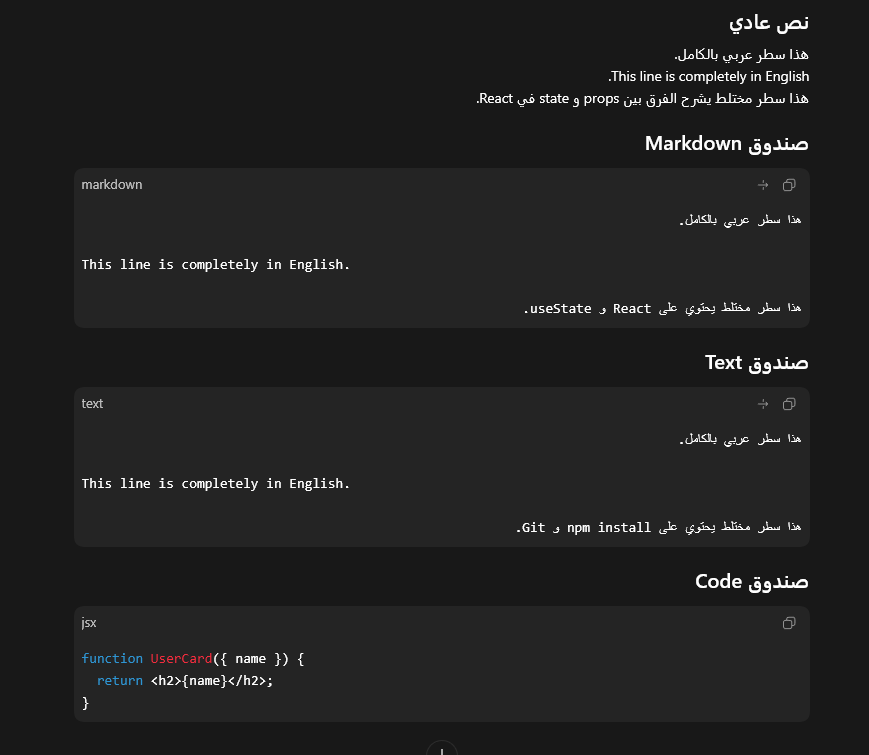
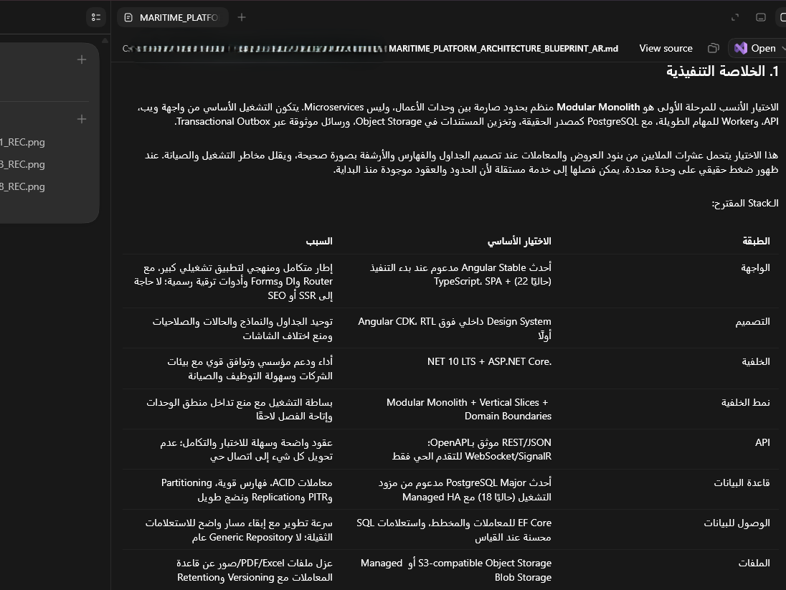

# Codex (ChatGPT Desktop) RTL Toolkit

Session-local RTL rendering fixes for Codex through ChatGPT Desktop on Windows and macOS. Arabic-script text reads right-to-left, English stays left-to-right, and programming code keeps its normal layout.

Codex Desktop is now shipped through the ChatGPT desktop app on some Windows installs. This toolkit targets that Codex/ChatGPT Desktop experience, not ordinary browser ChatGPT.

## Quick Start

**Download, extract, and double-click `Run-CodexRTL.cmd`.**

1. Download [`codex-rtl-toolkit-v0.1.6.zip`](https://github.com/pawnsmaster/codex-rtl-toolkit/releases/latest).
2. Extract the ZIP.
3. Save any unfinished input in Codex/ChatGPT Desktop.
4. Double-click `Run-CodexRTL.cmd`.

Codex/ChatGPT Desktop may remain active after its window is closed. The launcher safely closes any running desktop app processes, starts a fresh RTL-enabled session, and applies the fix automatically.

Requirements: Windows or macOS, Node.js 20+, and Codex through ChatGPT Desktop.

### macOS

1. Download and extract the project.
2. Open Terminal in the extracted folder.
3. Run `bash desktop/Run-CodexRTL.command`.

The launcher finds `ChatGPT.app` or `Codex.app`, restarts it with a localhost-only debugging port, and applies the same session-local fix used on Windows. It does not modify or re-sign the application. Set `CODEX_RTL_APP_PATH` if the app is installed somewhere else.

## Supported Languages

The toolkit detects RTL text written with the Arabic script. It supports Arabic, Persian, Urdu, Arabic-script Kurdish such as Sorani, Pashto, and Sindhi. English and other Latin-script lines remain LTR.

## What It Fixes

- Arabic-script RTL paragraphs align right.
- Mixed RTL and English text renders in the correct order.
- English runs and sentence-ending punctuation keep their natural position inside RTL text.
- Fenced `text` and `markdown` blocks choose direction per line: Arabic-script lines are RTL and English-only lines are LTR.
- Markdown blocks work with or without headings, lists, or other Markdown syntax tokens.
- Arabic-script Markdown files displayed in the side panel use RTL per line while English and code lines remain LTR.
- Code blocks, terminals, file paths, and inline code remain LTR.
- English-heavy messages keep their normal direction.
- Dynamically rendered chat blocks are rescanned as soon as their lines appear.

## Screenshots

### Mixed chat content

Normal messages, fenced Markdown, fenced text, and programming code keep the appropriate direction independently.



### Markdown side panel

Arabic-script Markdown content, tables, and mixed technical terms render RTL inside the Codex side panel.



## What the Launcher Does

- closes running or background Codex/ChatGPT Desktop processes
- checks that Node.js and npm are installed
- runs `npm ci --ignore-scripts` on the first launch
- starts Codex through ChatGPT Desktop with a DevTools port bound only to `127.0.0.1`
- injects the local RTL rendering fix as soon as the renderer is ready
- checks GitHub Releases at most once every 24 hours and prints a link when an update is available

It does not download updates automatically or change your messages, account data, or app installation files.

## Manual Start

For users who prefer not to run the CMD launcher, install dependencies from PowerShell:

```powershell
npm ci --ignore-scripts
```

Close Codex/ChatGPT Desktop completely, then start it with the local debugging port:

```powershell
.\desktop\Launch-CodexRTL.ps1
```

In another terminal, inject the RTL fix:

```powershell
npm run inject
```

If the injector cannot find the app, keep a conversation open and run `npm run inject` again.

## Security

The launcher uses Chromium DevTools on localhost only:

```text
127.0.0.1:9223
```

Do not expose this port through a tunnel, proxy, firewall rule, or shared machine. The injector refuses non-local DevTools targets.

This is a community workaround because the desktop app does not currently expose a documented plugin API for changing its CSS. Read [`SECURITY.md`](SECURITY.md) and [`SECURITY_AUDIT.md`](SECURITY_AUDIT.md) for the threat model and audit notes.

## Browser Extension

1. Open `chrome://extensions`.
2. Enable Developer mode.
3. Click Load unpacked.
4. Select the `extension` folder.

The extension applies the same rendering fix to `chatgpt.com`. Codex through ChatGPT Desktop is the toolkit's primary target.

## Limitations

- Desktop injection lasts for the current renderer session. If the app reloads, run `npm run inject` again.
- The desktop launcher depends on the app accepting Chromium flags. If a future build blocks that, use the browser extension path until a better app-level hook exists.
- CSS selectors are intentionally broad because Codex UI class names can change.

## Development

After editing files in `src/`, sync the browser extension copy:

```powershell
npm run build:extension
```

Before opening a PR or release:

```powershell
npm run check
```

Security review artifacts:

- `SECURITY.md`: safe usage and reporting policy.
- `SECURITY_AUDIT.md`: audit report for the current codebase.
- `docs/security-checklist.md`: release checklist.

## Project Layout

- `src/`: shared RTL JavaScript and CSS.
- `desktop/`: Windows and macOS launchers plus the shared desktop injector.
- `extension/`: unpacked Chrome/Edge extension.
- `scripts/`: sync and validation helpers.
- `docs/architecture.md`: implementation details.
- `docs/security-checklist.md`: release safety checklist.
- `SECURITY.md`: threat model and safe usage.
- `SECURITY_AUDIT.md`: security audit report.

## License

MIT
